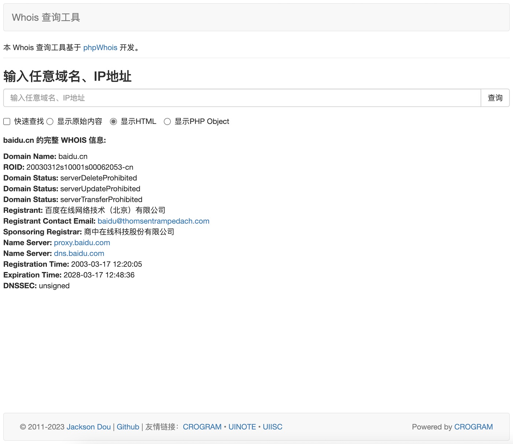

# Whois 查询工具

### 简介：

本项目是一款用 PHP 开发的 Whois 查询工具，安装简单，使用方便。

在线体验：[http://whois.uiisc.com](http://whois.uiisc.com)

### 使用

1. 下载源码 [jksdou/php-app-whois](https://github.com/jksdou/php-app-whois)，将 `src` 目录上传到您的服务器

2. 打开您的站点，如：http://whois.uiisc.com

3. 输入您要查询的域名，如：google.com

4. 点击查询按钮

### 预览

